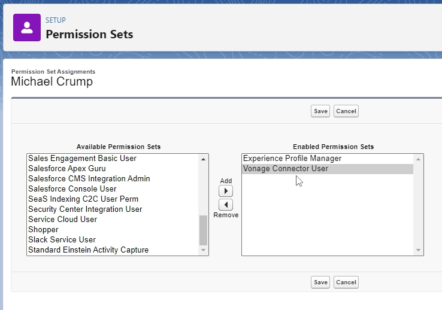
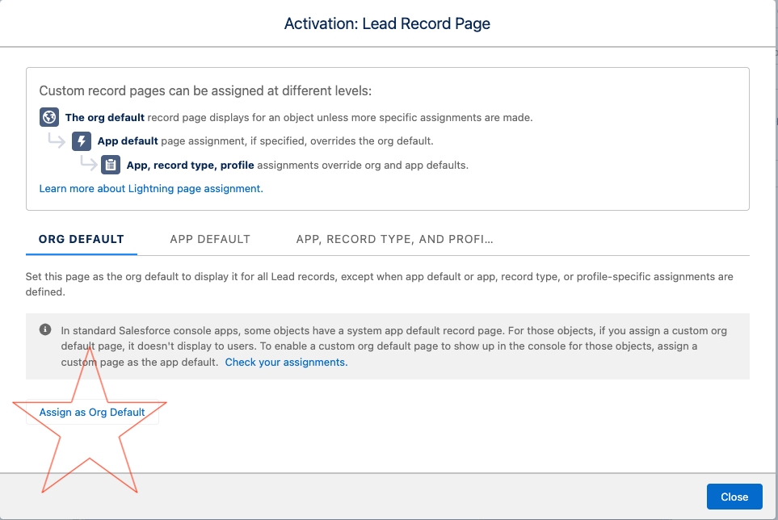

# Welcome to the Vonage and Salesforce Mini-Hack Tutorial!

## Introduction

With [Vonage Conversations for Salesforce](https://www.vonage.com/communications-apis/conversations-salesforce/), you can turn your Salesforce into a personalized engagement tool and reach customers at scale across SMS, MMS, and WhatsApp from the Salesforce CRM — and seamlessly blend bots and agents too!

In this Mini-Hack, we are going to install it through the Salesforce AppExchange and send an SMS notification directly inside of Salesforce! 

## Prerequisites

1. To follow along, ensure that you have a [Salesforce Development Org](https://developer.salesforce.com/signup) You will use this org to create the demo.

2. Create a [Vonage Developer Account](https://developer.vonage.com/) and ensure you are using a 10DLC number. 

## Installing the package

[Install the package](https://login.salesforce.com/packaging/installPackage.apexp?p0=04t4G000000QMtJQAW) called **Vonage Communication Platform for Salesforce**. 

The installation password is **CSFGA23**. 

Press **Install** to continue. If you see a warning message that it might take a while to complete, select **Done** and wait for the package deployment to complete.

If you see the following window asking you to **Approve Third-Party Access**, select the **check box** and press **continue**. 

## Setting up the Package

Once the package has been installed, we’ll need to configure it to complete the installation. You should see a **Bell Notification** beside your user avatar. 

Once you click on it, then you’ll see the following notification. Click it to continue the installation process. 

You’ll be presented with a wizard that walks you through 5 steps. Click **Next** on **Step 1** to continue. 

For **Step 2**, click the link to authenticate with Vonage - please ensure that you are using the **hackthon demo account** credentials supplied by our registration portal earlier.(Prerequisites step 6)

Next, you will be taken to the **Vonage API Dashboard** to login. Use the **hackthon demo account** credentials. Once authentication is completed, you will see this confirmation and can return to Salesforce:

In **Step 3**, you’ll see a link back to the Vonage API Dashboard, where you can configure your account, add API keys, and rent additional LVNs. Let’s just press **Next** to continue. 

In **Step 4**, select the API key you want to use and press **Next**. In our case there is only one API key, dedicated to this hackathon.

**Step 5** will show the numbers associated with the API key, along with the channels those numbers support. Please make sure to use the number assigned to you from the registration portal earlier.(Prerequisites step 6) then press **Finish**. 

Once this is complete, the setup is done and you will see the following message:

The next step is to set the permissions for which users can use the Vonage package. 

To do this, press the **Setup Cog** (upper right-hand corner of your screen). 

On the **Quick Find** (upper left-hand corner of your screen) navigate to **Users**:

Select the user that you want to assign this to. 

Look for **Permission Set Assignments**, then select **Edit Assignments** as shown below. 

This will bring you to **Permission Sets**. Select **Vonage Connected User** and press **Add** then **Save** as shown below. 

## Sample Data

Let’s setup a Lead for a simulated customer interaction. 

Head over to **Leads** in your Salesforce instance by hitting the app launcher in the upper left corner of your screen:

Either create or modify an existing lead and enter **your mobile number** where we can verify if it works or not. **The number needs to follow the international format code**, ex. 14259999999 for US numbers. 

## Add the Vonage Widget

Remaining on the **Your Lead** page, add the Vonage UI Widget

From the Setup cog (Upper right-hand corner on your scrren) select **Edit page** as shown below. 

Locate the **Vonage Conversation** UI widget in the Components menu. Then drag it to its designated location on the screen. I put mine under “Related”. Finally, set if the agent can select the Brand Endpoint. For this demo, you can leave it on "Never" and a quick explanation can be found below.   

* If Never - the agent cannot select the Brand Endpoint and the default one will be used automatically. 
* If Always - the agent will be able to choose the Brand Endpoint from the drop-down list: 

The widget will automatically identify all the populated **Phone** type fields in the record and will add them to the drop down to allow the agent to select which number to send message. Finally, save and activate the widget. You will want to take the option to **Assign as Org Default** when presented. 

For the form factor, please select **Desktop and Phone** to continue. 

## Sending an SMS Message

You can now send a test message to the Lead directly through Salesforce! If you followed the instructions then you should get a text message on your mobile phone number and you will also see it on the Vonage UI Widget. Below is a sample conversation that shows sending and receiving SMS messages. 

Congratulations :partying_face:, you completed the first part of the hackathon :clap:. 

For an extra challenge, and an additional prize, then complete the Bonus section next! :trophy: 

## Develop BOT answering machine (Bonus Section)

BOTs can be developed very easily using the Salesforce Flow infrastructure.
Lets develop a BOT for generating automatic response to incoming messages:
The BOT will receive a notification regarding an incoming message. The incoming message will be related to the Lead record from the first step.
The BOT will send back a message containing the Lead Last Name. 

 

Lets start building the flow: Press the **Setup Cog** (upper right-hand corner of your screen). 

On the **Quick Find** (upper left-hand corner of your screen) navigate to **Flows**:

Select the **New Flow** button:

As will be discussed at the technical details below, for this hackaton case, we would use the **Platform Event** flow:

Before jumping in, lets review some technical details about the Vonage Conversations For Salesforce internals: 

Incoming messages are processed by the package and persisted as inbound records.

Any incoming or outgoing message is persisted as **VC__Interaction__c** record. 

In order to send an outbound message, a new outbound record should be inserted. Any inserted outbound message is sent out automatically.

On every record creation a platform event is published:  **VC__InteractionEvent__e** . Please notice that the event is published for Inbound AND Outbound records.

**The Flow:**

If the incoming message is an outbound message - ignore it.

If the incoming message is an inbound message, fetch its details.

Create a new outgoing message, fill-in all the new record details and insert it. 

First step would be to configure the flow based on the platform event. The configuration details:

Let focus only on the incoming messages:

Now, fetch the information about the incoming message:

And generate the answer:

**The required fields are listed at the table below**

An Outbound **VC_Interaction__c** record fields are:

| API Name  | Description  | Valid Values  |
|---|---|---|
| VC__Brand_Endpoint__c  | The number from which the message is sent  | Your demo account number |
| VC__Channel__c  | The type of message (SMS, MMS, WhatsApp)  | For the hackathon, use the VC__Channel__c  of the incoming message.  |
| VC__Content_Text__c  |  The message text |  Your response message |
| VC__Direction__c  |  The direction of the message. Valid values are Inbound or Outbound |  For sending out a message always use "Outbound" |
| VC__Interaction_Media__c  |  The type of media that is used.  |  Always use "Text" |
| VC__Interaction_Originator__c  |  Free text, to add details about the sender. This information is not sent with the outbound message but can be used later by the package for monitoring. |  It is our recommendation to populate this field with the identifier of the process which created the message. For example, if it was created by a flow - use here the flow name. |
| VC__Interaction_Originator_Type__c  |  The type of process which created this message. Valid values are: Customer, Bot, Agent, Agent Assist |  Bot is the recommended value for messages created by flow or apex. |
| VC__Party_Endpoint__c  |  The phone number of the customer being contacted by the brand |  Use the VC__Party_Endpoint__c  of the incoming message. |
| VC__Thread__c  |  The Thread which owns this Interaction |  For the hackathon, use the VC__Thread__c  of the incoming message. |
| VC__Lead__c  |  The Lead which the message is related to. |  For the hackathon, use the VC__Lead__c  of the incoming message. |

Save and activate your Flow:

Use **your mobile phone** to send text messages to your configured number which was assigned to you by the registration service. (Prerequisites step 6)
As the BOT is active, it will process the responses based on the content of the incoming request, and you are expected to get an answer back! :calling:

## Conclusion 

This concludes the Vonage and Salesforce Mini-Hack. Today, you learned how to integrate [Vonage Conversations for Salesforce](https://www.vonage.com/communications-apis/conversations-salesforce/) into Salesforce in about 30 minutes to quickly implement a customer engagement solutions - all without writing a single line of code! To learn more about other Vonage APIs,  check out the [Vonage blog](https://developer.vonage.com/en/blog/) page. 

Finally, if you have questions or feedback, join us on the [Vonage Developer Slack](https://developer.vonage.com/community/slack) or send us a Post on [X](https://twitter.com/vonagedev), and we'll get back to you. Thanks again for participating, and we'll catch you on the next one!
